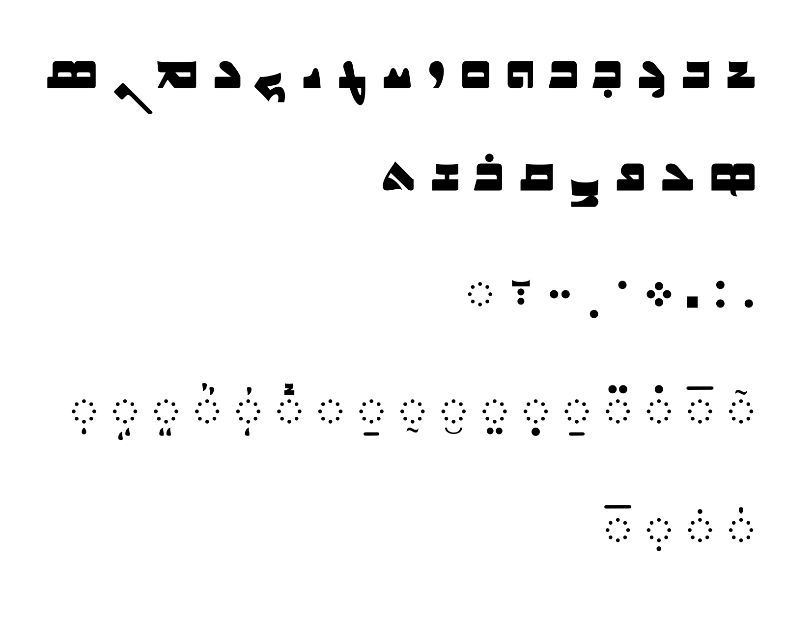
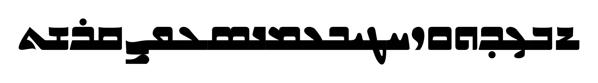
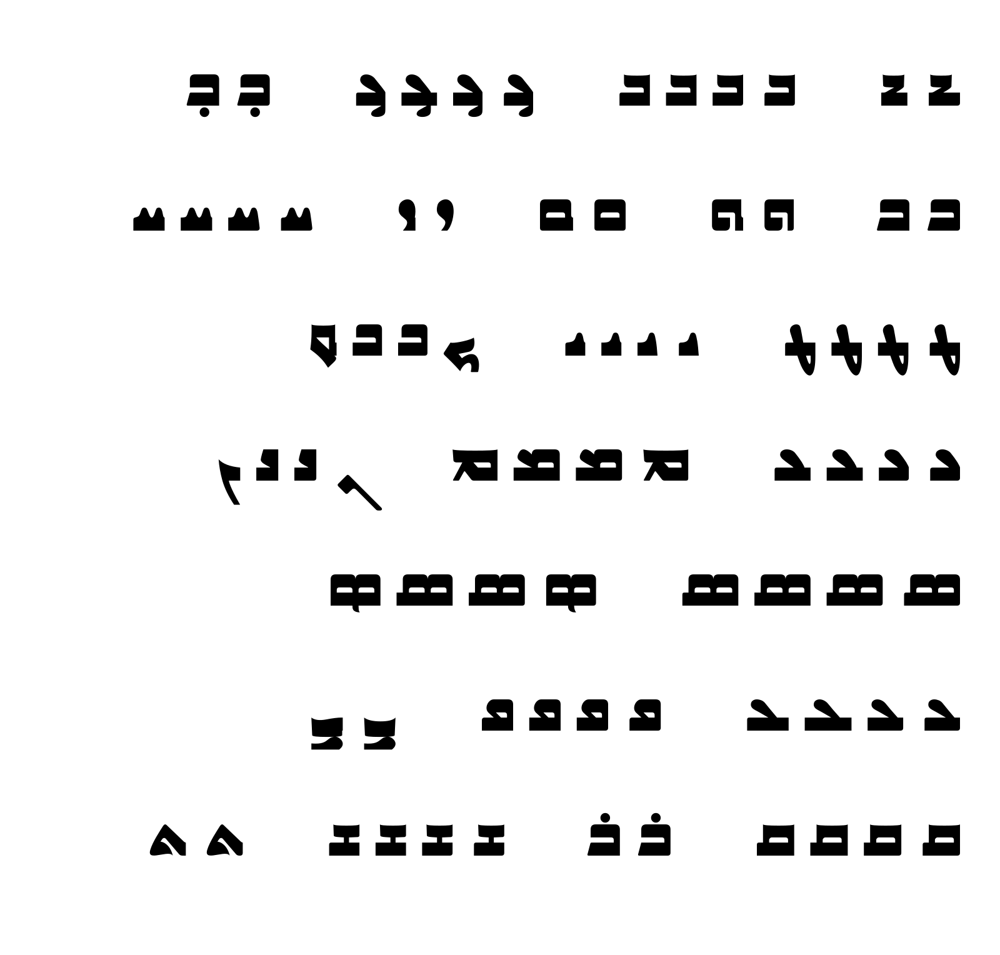
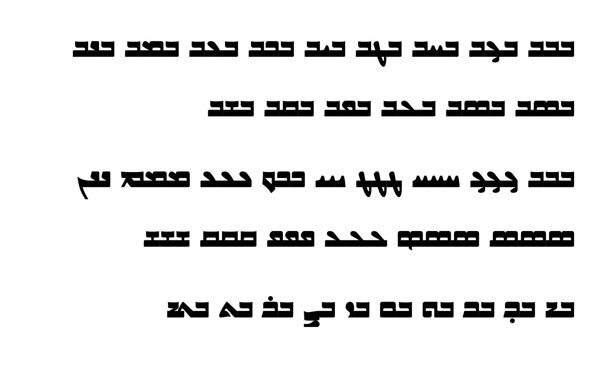
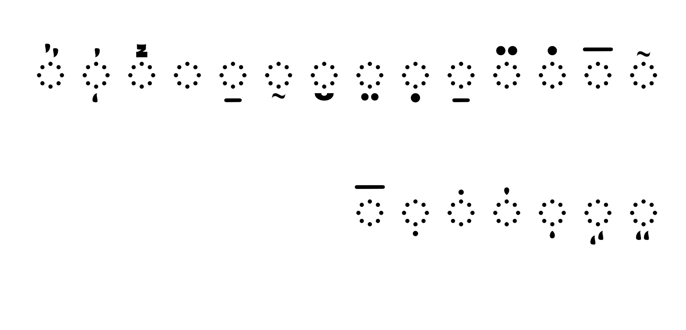
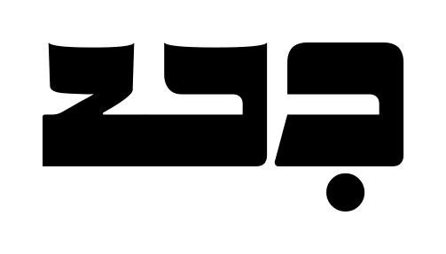
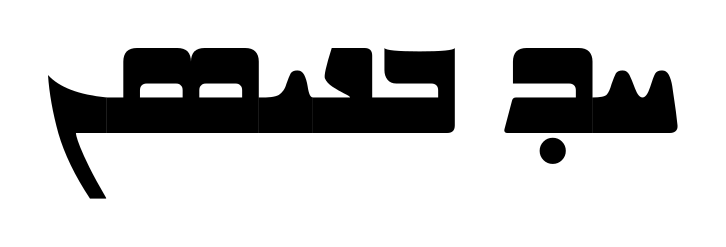
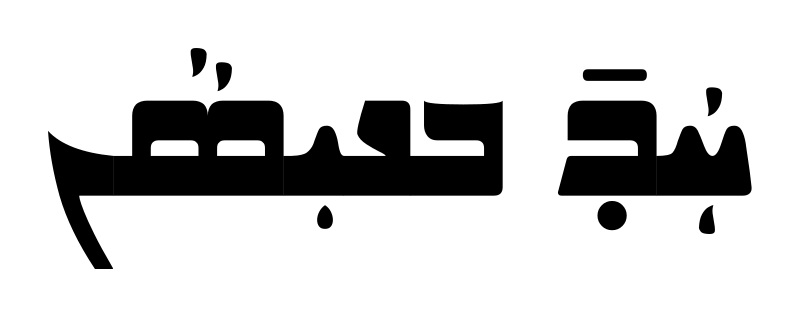
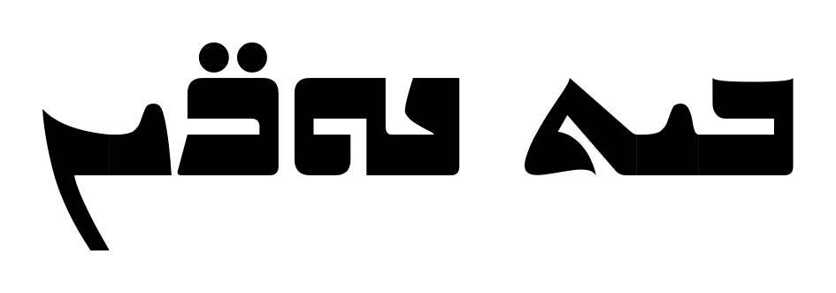
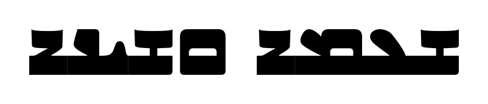

# DibaSyriac

A mid-century modern Assyrian typeface design inspired by the calligraphic style of Issa Benyamin and the font designs in his book, [ܫܦܝܪܘܬ-ܟܬܝܒܬܐ: ܟܠܝܓܪܦܐ ܐܬܘܪܝܬܐ](https://16209.rmwebopac.com/item/YF2zBolt1ESHSlLWcwZrmQ_tFCUl6V_bUCk20oxa64kGw). The font in this project is adapted from Benyamin's general style with some twists, adaptions and changes.

## Character set

## Connecting forms

## Joining

## Vowels and marks

## Samples

All the images above are rendered from the built font by `make images`, so they
always show the current font.

## Checking the font

    make all      # build, report, proof sheet, images, then tests
    make ci       # exactly what GitHub runs on every push

or one step at a time:

| Command      | What it does |
|--------------|--------------|
| `make build` | Compiles `sources/Diba.glyphs` to `fonts/Diba-Regular.ttf` and adds dropout control (`scripts/fix_hinting.py`), since ttfautohint can't hint Syriac. |
| `make qa`    | Lists problems letter by letter: joins that don't line up, gaps, flat cuts on sides that never join, corners rounded differently from the rest, edges a few units off a common height, lines almost but not quite flat, marks too close to a letter or its neighbours. |
| `make test`  | Pass/fail tests that every joint meets the connecting stroke exactly, that HarfBuzz picks the right forms, that every vowel and mark attaches at its anchor without touching its own letter, the letters beside it, or a mark stacked on it, and that no character in the font draws nothing. |
| `make fontbakery` | Runs [fontbakery](https://github.com/fonttools/fontbakery)'s universal checks. Reports go to `out/fontbakery.html` and `out/fontbakery.md`. |
| `make proof` | Writes and opens `out/proof.html`: every problem circled on the glyph, every letter in every form, every joining pair, vowels and marks on every letter, punctuation and live text. |
| `make images`| Renders the images above into `documentation/`. |
| `make ci`    | Rebuilds the font from the source, then fails on any QA error, failing test or fontbakery failure; then writes the proofs and images. |

To check a font exported from Glyphs instead: `make qa proof test FONT=path/to/Diba-Regular.ttf`.

Something flagged on purpose? Add `<glyph> <check>` to `qa/allow.txt` with a note saying why. For a mark running into a neighbouring letter, `<glyph> mark-neighbour <mark>` excuses just that one mark.

## License

Diba is licensed under the [SIL Open Font License 1.1](OFL.txt).
