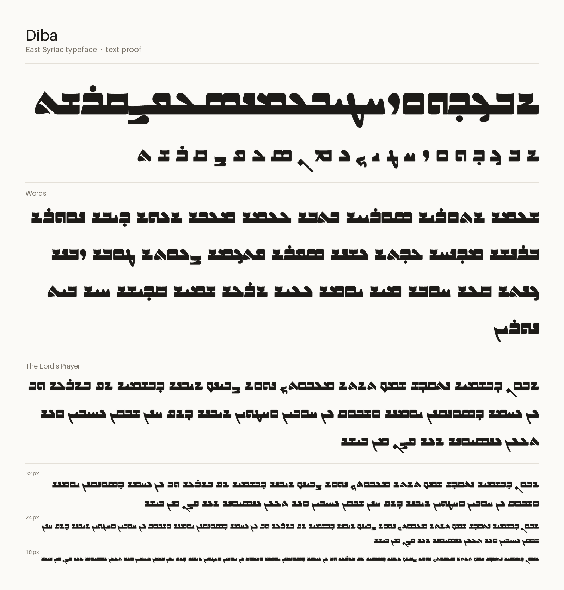
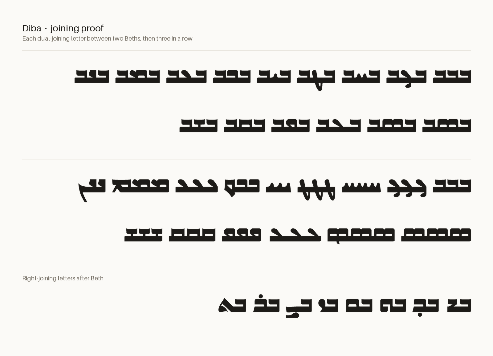

# DibaSyriac

An East Syriac typeface.

The images are rendered from the built font by `make images`.

## Checking the font

    make all      # build, report, proof sheet, images, then tests

or one step at a time:

| Command      | What it does |
|--------------|--------------|
| `make build` | Compiles `sources/Diba.glyphs` to `fonts/Diba-Regular.ttf`. |
| `make qa`    | Lists problems letter by letter: joins that don't line up, gaps, flat cuts on sides that never join, corners rounded differently from the rest, edges a few units off a common height, lines almost but not quite flat. |
| `make proof` | Writes and opens `out/proof.html`: every problem circled on the glyph, every letter in every form, every joining pair, sample words and live text. |
| `make images`| Renders the text proofs above to `documentation/proof-text.png` and `documentation/proof-joins.png`. |
| `make test`  | Pass/fail tests that every joint meets the connecting stroke exactly and that HarfBuzz picks the right forms. Fails only on broken joins. |

To check a font exported from Glyphs instead: `make qa proof test FONT=path/to/Diba-Regular.ttf`.

Something flagged on purpose? Add `<glyph> <check>` to `qa/allow.txt` with a note saying why.
