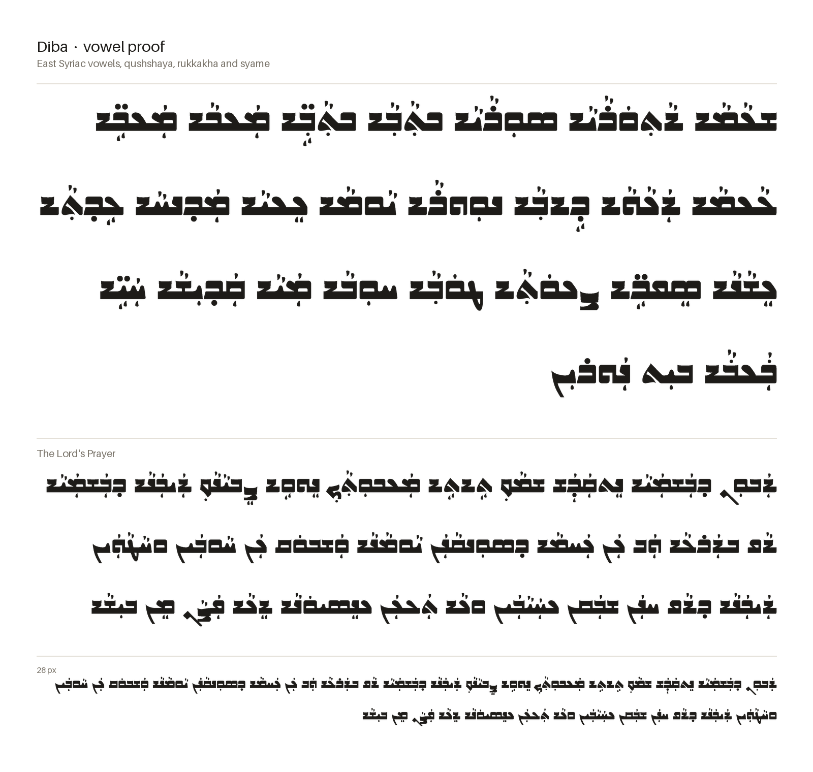

# DibaSyriac

A mid-century Eastern Assyrian typeface inspired by the calligraphic style of Issa Benyamin and the typeface designs in his book, [ܫܦܝܪܘܬ-ܟܬܝܒܬܐ : ܟܠܝܓܪܦܐ ܐܬܘܪܝܬܐ](https://16209.rmwebopac.com/item/YF2zBolt1ESHSlLWcwZrmQ_tFCUl6V_bUCk20oxa64kGw). The font in this project is adapted from Benyamin's general style with some twists and adaptions for a digital font.

The images are rendered from the built font by `make images`.

## Checking the font

    make all      # build, report, proof sheet, images, then tests

or one step at a time:

| Command      | What it does |
|--------------|--------------|
| `make build` | Compiles `sources/Diba.glyphs` to `fonts/Diba-Regular.ttf`. |
| `make qa`    | Lists problems letter by letter: joins that don't line up, gaps, flat cuts on sides that never join, corners rounded differently from the rest, edges a few units off a common height, lines almost but not quite flat. |
| `make proof` | Writes and opens `out/proof.html`: every problem circled on the glyph, every letter in every form, every joining pair, vowels and marks on every letter, sample words and live text. |
| `make images`| Renders the text proofs above to `documentation/proof-text.png`, `proof-joins.png` and `proof-vowels.png`. |
| `make test`  | Pass/fail tests that every joint meets the connecting stroke exactly, that HarfBuzz picks the right forms, and that every vowel and mark attaches at its anchor without touching its own letter, the letters beside it, or a mark stacked on it. |

To check a font exported from Glyphs instead: `make qa proof test FONT=path/to/Diba-Regular.ttf`.

Something flagged on purpose? Add `<glyph> <check>` to `qa/allow.txt` with a note saying why.
